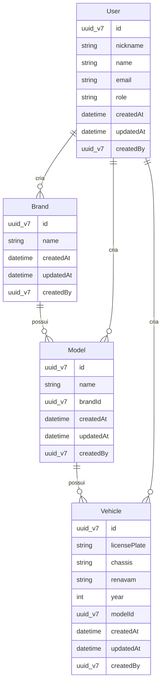
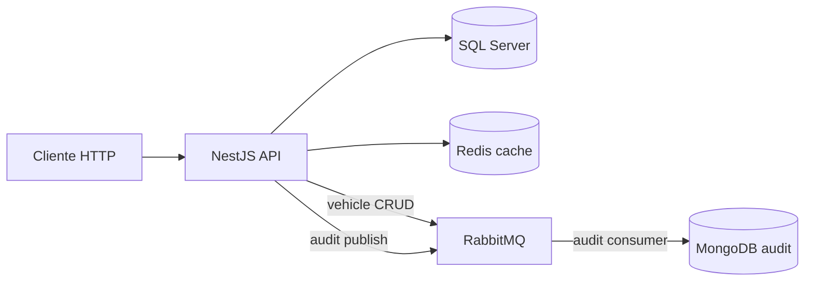

# Aivacol API — Gestão de Frota

Backend REST do módulo **Gestão de Frota** da plataforma Aivacol (teste técnico NestJS).

A API permite cadastrar e consultar a frota em uma hierarquia simples: **marca → modelo → veículo**. Cada veículo possui placa, chassi, RENAVAM e ano, vinculado a um modelo que, por sua vez, pertence a uma marca. O acesso é protegido por JWT; um usuário administrador e dados de demonstração são criados automaticamente pelo seed.

**Gerenciador de pacotes:** [Yarn](https://yarnpkg.com/)

---

## O que você vai encontrar

- CRUD completo de **marcas**, **modelos** e **veículos**
- Regras de integridade referencial (ex.: não é possível excluir marca com modelos vinculados → `409 Conflict`)
- **Cache Redis** nas consultas padrão de veículos, com invalidação automática em alterações
- Autenticação **JWT** com papéis `admin` e `operator`
- Documentação interativa via **Swagger** (`/api/docs`)
- Eventos de veículos no **RabbitMQ** (módulo `vehicles`) e auditoria assíncrona de requisições via fila → **MongoDB** (módulo `audit`)
- Testes automatizados (unitários, e2e e integração com SQL Server + Redis)

| Tecnologia | Papel |
|------------|-------|
| NestJS 11 | Framework da API REST |
| SQL Server + TypeORM | Persistência e migrations |
| Redis | Cache de listagem/consulta de veículos |
| RabbitMQ | Eventos de CRUD de veículos e fila de auditoria |
| MongoDB | Persistência dos registros de auditoria HTTP |
| JWT | Proteção de rotas (exceto login) |
| Swagger | Documentação OpenAPI |
| Helmet + Throttler | Segurança HTTP e rate limiting |

---

## Modelo de domínio

A frota segue uma cadeia de dependência: toda **marca** pode ter vários **modelos**, e todo **modelo** pode ter vários **veículos**. Usuários são uma entidade separada, usada para autenticação e administração.



Todas as entidades de domínio estendem [`BaseEntity`](src/modules/bases/entities/base.entity.ts) (`id`, `createdAt`, `updatedAt`, `createdBy`). Os identificadores são **UUID v7** (version nibble `7`, ordenáveis por tempo), gerados automaticamente no insert e validados em path params e DTOs. UUID v4 ou formatos inválidos retornam **400**. Exemplo válido: `018f1234-5678-7890-abcd-ef1234567890`.

**Regras principais:**

- Todo model deve ter `brandId` (obrigatório no cadastro)
- Não é possível excluir uma marca que ainda possui modelos (`409`)
- Não é possível excluir um model que ainda possui veículos (`409`)
- Placa, chassi e RENAVAM de veículos são únicos no sistema
- **Placa:** formato legado (`ABC1234`) ou Mercosul (`ABC1D23`)
- **Chassi/VIN:** 17 caracteres alfanuméricos
- **RENAVAM:** 11 dígitos numéricos

---

## Arquitetura

Com Docker Compose, a API sobe junto com toda a infraestrutura necessária:



SQL Server persiste a frota; Redis acelera consultas de veículos; RabbitMQ publica eventos de CRUD de veículos e enfileira registros de auditoria; um consumer no mesmo processo da API grava a auditoria no MongoDB.

---

## Comece em 5 minutos

**Pré-requisitos:** Node.js 24+ (mesma versão do [Dockerfile](Dockerfile)), Yarn e Docker com Docker Compose.

### 1. Configure o ambiente

```bash
cp .env.example .env
yarn install
```

O `.env.example` já traz valores padrão para rodar com Docker (SQL Server, Redis, RabbitMQ e MongoDB). Ajuste `JWT_SECRET` (mínimo 32 caracteres) e `DB_PASSWORD` se necessário.

### 2. Suba a stack completa

```bash
yarn docker:up
```

Esse comando sobe **API + SQL Server + Redis + RabbitMQ + MongoDB**. O entrypoint da API ([`scripts/docker-entrypoint.sh`](scripts/docker-entrypoint.sh)) aguarda os serviços, cria o banco (`db:create`), aplica migrations e executa o seed antes de iniciar o NestJS.

Aguarde a mensagem **"Nest application successfully started"** nos logs.

Para parar: `yarn docker:down`.

### 3. Acesse os serviços

| Serviço | URL |
|---------|-----|
| API (prefixo REST) | http://localhost:4000/api/v1 |
| Swagger UI | http://localhost:4000/api/docs |
| RabbitMQ Management | http://localhost:15672 (guest / guest) |
| MongoDB | mongodb://localhost:27017 |

> Em `NODE_ENV=production`, o Swagger **não é exposto**.

### 4. Credenciais do seed

Após o seed, use estas credenciais para login:

| Campo | Valor |
|-------|--------|
| E-mail | `admin@aivacol.com` |
| Senha | `Aivacol123!` |
| Nickname | `aivacol` |
| Papel | Admin |

O seed também carrega marcas, modelos e veículos de demonstração a partir de [`src/database/seed-data/fleet.seed.json`](src/database/seed-data/fleet.seed.json).

---

## Tutorial: primeiro fluxo na API

Este passo a passo usa o **Swagger** em http://localhost:4000/api/docs. O mesmo fluxo funciona com curl, as coleções em [`api-client/`](api-client/) (Postman e Insomnia) ou qualquer cliente HTTP.

### Passo 1 — Login

Execute `POST /auth/login` com:

```json
{
  "email": "admin@aivacol.com",
  "password": "Aivacol123!"
}
```

A resposta vem no envelope padrão da API:

```json
{
  "data": {
    "login": {
      "accessToken": "eyJhbGciOiJIUzI1NiIsInR5cCI6IkpXVCJ9...",
      "refreshToken": "...",
      "tokenType": "Bearer",
      "expiresIn": 3600
    }
  }
}
```

Copie o valor de `data.login.accessToken`.

### Passo 2 — Autorizar no Swagger

Clique em **Authorize** (cadeado) e informe `Bearer <accessToken>`.

### Passo 3 — Listar marcas

`GET /brands` retorna as marcas do seed (Volkswagen, Fiat, Toyota, etc.).

Listagens usam paginação no formato **connection**:

```json
{
  "data": {
    "brands": {
      "nodes": [ { "id": "...", "name": "Toyota" } ],
      "pageInfo": { "hasNextPage": false, "hasPreviousPage": false },
      "totalCount": 12
    }
  }
}
```

### Passo 4 — Criar um model

`POST /models` — o campo `brandId` é **obrigatório**. Use o `id` de uma marca listada no passo anterior:

```json
{
  "name": "Corolla XEi",
  "brandId": "018f1234-5678-7890-abcd-ef1234567890"
}
```

Resposta de item único:

```json
{
  "data": {
    "model": {
      "id": "...",
      "name": "Corolla XEi",
      "brandId": "..."
    }
  }
}
```

### Passo 5 — Cadastrar um veículo

`POST /vehicles` — placa, chassi e RENAVAM devem ser **únicos**:

```json
{
  "licensePlate": "ABC1D23",
  "chassis": "9BWZZZ377VT004251",
  "renavam": "12345678901",
  "year": 2024,
  "modelId": "018f1234-5678-7890-abcd-ef1234567890"
}
```

### Passo 6 — Validar regra de negócio

Tente `DELETE /brands/:id` em uma marca que ainda possui models vinculados. A API deve responder **409 Conflict**, impedindo a exclusão.

---

## Autenticação e papéis

Todas as rotas exigem JWT, **exceto** `POST /auth/login` (pública, com rate limit extra).

| Papel | Permissões |
|-------|------------|
| `admin` | DELETE em marcas, models e veículos; CRUD completo de `/users`; `GET /users/me` |
| `operator` | CRUD de frota **exceto** DELETE; `GET /users/me` |

O login possui limite de tentativas configurável via `THROTTLE_LOGIN_TTL` e `THROTTLE_LOGIN_LIMIT`.

O login emite `accessToken` e `refreshToken`, mas **não há endpoint de refresh** — o cliente deve descartar ambos os tokens no logout (`POST /auth/logout`).

---

## Convenções da API

- **Envelope de resposta:** item único em `{ data: { chaveRecurso: ... } }`; listagens em `{ data: { chaveRecurso: { nodes, pageInfo, totalCount } } }` (formato connection).
- **Paginação:** query params `first` (padrão 25, máx. 100) e `skip` (padrão 0).
- **Includes:** models e veículos aceitam `includeBrand=true` (e equivalentes) para aninhar relações; em GET de veículos, includes ou filtros customizados **desativam** o cache Redis.

---

## Endpoints — referência rápida

Prefixo global: `API_PREFIX` (padrão `api/v1`).

| Módulo | Rotas | Observação |
|--------|-------|------------|
| Auth | `POST /auth/login`, `POST /auth/logout` | login público |
| Brands | CRUD `/brands` | DELETE só admin; 409 se houver models |
| Models | CRUD `/models` | `brandId` obrigatório no create |
| Vehicles | CRUD `/vehicles` | cache Redis em GET padrão; eventos RabbitMQ em mutações; DELETE admin |
| Users | CRUD `/users`, `GET /users/me` | admin exceto `/me` |

Detalhes de parâmetros, filtros e schemas: use o **Swagger**.

---

## Recursos avançados

### Cache Redis (veículos)

- Chaves: `vehicles:list` e `vehicles:id:{uuid}`
- Ativo apenas em GET list/id **sem filtros, includes ou paginação customizada**
- Invalidação automática em create, update e delete
- TTL configurável: `REDIS_CACHE_TTL` (segundos)

### RabbitMQ (eventos de veículos)

O módulo [`vehicles`](src/modules/vehicles/) publica eventos na exchange `aivacol.vehicles` após create, update e delete:

| Routing key | Quando |
|-------------|--------|
| `vehicle.created` | Veículo cadastrado |
| `vehicle.updated` | Veículo atualizado |
| `vehicle.deleted` | Veículo removido |

UI de monitoramento: http://localhost:15672 (guest / guest).

### Auditoria MongoDB

O módulo [`audit`](src/modules/audit/) intercepta cada requisição HTTP (exceto Swagger) e registra método, path, status, duração e usuário autenticado.

Fluxo assíncrono:

1. `AuditInterceptor` → `InteractionAuditService.record()`
2. Publicação na fila `aivacol.audit.interactions` (exchange `aivacol.audit`, routing key `interaction.record`)
3. `InteractionAuditConsumer` (mesmo processo da API) persiste no MongoDB

Se a publicação na fila falhar, a gravação direta no MongoDB é usada como fallback.

Variáveis relacionadas: `RABBITMQ_URL`, `RABBITMQ_AUDIT_EXCHANGE`, `RABBITMQ_AUDIT_QUEUE`, `MONGODB_URI`, `MONGODB_DATABASE`.

### Segurança HTTP

- **Helmet** — headers de segurança
- **CORS** — origens em `CORS_ORIGINS` (vazio = desabilitado)
- **Throttler** — rate limit global (`THROTTLE_TTL` / `THROTTLE_LIMIT`)
- Erros padronizados via `HttpExceptionFilter` (`statusCode`, `message`, `error`, `timestamp`, `path`)

Variáveis de ambiente completas: [`.env.example`](.env.example).

---

## Testes automatizados

| Comando | Escopo |
|---------|--------|
| `yarn test:unit` | Regras de negócio, services, DTOs |
| `yarn test:e2e` | HTTP com mocks, sem Docker |
| `yarn test` | Unitários + e2e |
| `yarn test:integration` | AppModule real com SQL Server e Redis |
| `yarn test:cov` | Cobertura unitária (mín. 80% lines/statements/functions, 70% branches) |
| `yarn check` | Biome (lint + format) |
| `yarn check:fix` | Corrige formatação/lint quando possível |

**Integração** — requer SQL Server e Redis em `localhost`:

```bash
docker compose up sqlserver redis -d
yarn test:integration
```

**API no host** — RabbitMQ e MongoDB também fazem parte da stack. Para rodar localmente com `yarn start:dev`, suba a infra completa ou, no mínimo, SQL Server, Redis, RabbitMQ e MongoDB:

```bash
docker compose up sqlserver redis rabbitmq mongodb -d
```

Ajuste no `.env`: `DB_HOST`, `REDIS_HOST`, `RABBITMQ_URL` e `MONGODB_URI` apontando para `localhost`.

```bash
yarn db:create
yarn migration:run
yarn seed
yarn start:dev
```

Os testes de integração forçam `DB_HOST=localhost` e `REDIS_HOST=localhost`, mesmo que o `.env` use hostnames Docker. Se a infra não estiver acessível, a suíte é **ignorada** (exit 0).

| Spec | O que valida |
|------|----------------|
| `fleet-flow.integration-spec.ts` | Login → brand → model → vehicle → CRUD completo |
| `fleet-referential.integration-spec.ts` | Model sem `brandId` → 400; delete brand com models → 409 |
| `vehicles-cache.integration-spec.ts` | Cache Redis: warm GET, invalidação POST/PATCH/DELETE |

Antes de entregar alterações:

```bash
yarn check:fix
yarn test
```

---

## Scripts úteis

| Script | Descrição |
|--------|-----------|
| `yarn validate:env` | Valida variáveis de ambiente (roda antes de `start` / `start:dev`) |
| `yarn start` / `yarn start:dev` | API (valida `.env` antes) |
| `yarn build` | Build de produção (`dist/`) |
| `yarn db:create` | Cria banco SQL Server se ainda não existir |
| `yarn migration:run` | Aplica migrations TypeORM |
| `yarn migration:revert` | Reverte última migration |
| `yarn migration:generate` | Gera migration a partir das entidades |
| `yarn seed` | Usuário admin + frota mock |
| `yarn test:watch` | Testes unitários em modo watch |
| `yarn test:debug` | Testes unitários com inspector Node |
| `yarn test:e2e:docker` | Alias de `yarn test:integration` |
| `yarn docker:up` / `yarn docker:down` | Sobe / para stack Docker completa |

---

## Estrutura do repositório

```
src/modules/
  auth/          # JWT, login, guards
  brands/        # CRUD de marcas
  models/        # CRUD de modelos
  vehicles/      # CRUD de veículos, cache Redis, publisher RabbitMQ
  users/         # CRUD de usuários
  audit/         # Interceptor HTTP, fila RabbitMQ, persistência MongoDB
  bases/         # BaseEntity + BaseResponseDto (id UUID v7, timestamps, createdBy)
src/database/    # Migrations, seeds, create-database, mock JSON
src/common/
  decorators/    # @Public, @Roles, @CurrentUser
  filters/       # HttpExceptionFilter
  pipes/         # ParseUuidV7Pipe
  validators/    # UUID v7, placa/chassi/RENAVAM, email, senha
  swagger/       # exemplos OpenAPI, schemas de erro
  dto/           # paginação, pageInfo
  utils/         # envelope de resposta (connection)
src/config/      # app, database, typeorm, cache, swagger, env-validation
scripts/         # validate-env.ts, docker-entrypoint.sh
test/e2e/        # Testes e2e com mocks (HTTP, sem Docker)
test/integration/# Testes com SQL Server + Redis (AppModule real)
test/common/     # helpers compartilhados (setup, fixtures de app)
test/fixtures/   # Dados/factories para testes
api-client/      # Coleções Postman e Insomnia
docker-compose.yml
Dockerfile
```

---

## Licença

Projeto privado (`UNLICENSED`).
